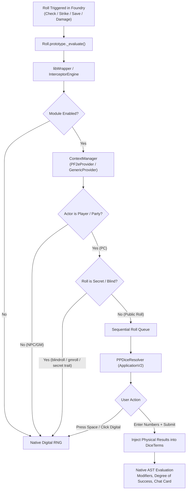

# Architecture: `pp-dice`

## Overview

`pp-dice` bridges physical tabletop dice rolling with Foundry VTT's automated math engine.

## Subsystem Architecture

### 1. Context Resolution (`src/core/context-manager.ts`)

- Pluggable architecture implementing `RollContextProvider`.
- **`PF2eContextProvider`**:
  - Direct integration with PF2e Party: `game.actors.party.members`, `actor.parties`, and `actor.system.details.alliance === "party"`.
  - Secrecy inspection: checks `roll.options.domains`, `roll.options.traits` for `"secret"`, and message modes (`"blind"`, `"gm"`).
  - Fortune/Misfortune inspection: checks `roll.options.rollTwice` and formulas containing `kh`/`kl`.
- **`GenericContextProvider`**:
  - Fallback inspecting `actor.hasPlayerOwner`, `actor.type === "character"`, and `roll.options.rollMode`.

### 2. Interception & Queue Engine (`src/core/interceptor.ts`)

- Wraps `Roll.prototype._evaluate` via `libWrapper` with fallback monkey-patch.
- **Sequential Promise Queue (`queueChain`)**: Prevents overlapping modals when multiple checks trigger simultaneously.
- **Term Injection (`applyPhysicalResults`)**: Replaces `results` array on target `DiceTerm` instances, marks `_evaluated = true`, and passes `allowInteractive: false` to the wrapped evaluation.

### 3. User Interface (`src/ui/pp-dice-resolver.ts`)

- Implemented with Foundry v14 **`foundry.applications.api.ApplicationV2`** and `HandlebarsApplicationMixin`.
- Keyboard-first interaction:
  - First die input focused on render.
  - `Enter`: Submit physical values.
  - `Space` (when not focusing an input) or clicking "Roll Digital": Immediate RNG fallback.
- Header display with token/actor art, action name, formula, and Fortune/Misfortune badges.

### 4. Integration Hooks (`src/main.ts` & `src/ui/controls.ts`)

- **Keybinding & Scene Controls**: `Alt+P` or token control toggle to enable/disable module on the fly.
- **Chat Badge**: Hooks `renderChatMessage` to display a `Physical Roll` tag on rolls carrying `FLAGS.PHYSICAL_ROLL`.
- **Dice So Nice (DSN)**: Physical rolls trigger 3D dice landing on the entered numbers (can be toggled in settings).
