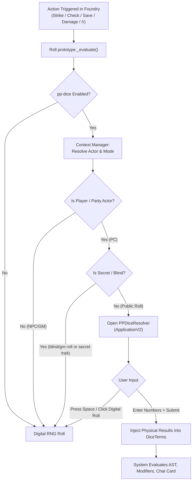

# Physical Play Dice (`pp-dice`) Design Specification

**Date:** 2026-09-23  
**Status:** Draft  
**Target:** Foundry VTT v14 (build 368+) & Pathfinder 2e (PF2e v8.5.1+)  
**Repository:** `phlay` (Module ID: `pp-dice`)

---

## 1. Context & Motivation

In an in-person ("physical play") tabletop RPG setup, the Game Master (GM) operates Foundry VTT on their laptop while a secondary display (TV or projector) presents an immersive scene to the players without a HUD (e.g., via *Monk's Common Display*).

Players roll real physical dice at the gaming table and write on paper character sheets. The GM operates the Foundry interface on their behalf (selecting tokens, triggering attacks, skill checks, and saving throws).

### Problem Statement
Standard Foundry VTT generates random digital rolls automatically. When players roll physical dice, the GM must either manually edit chat cards or perform mental arithmetic. Foundry's built-in manual dice fulfillment setting is global—it intercepts every single NPC attack, monster recharge, table roll, and secret check, interrupting the GM with unwanted popups.

### Solution: `pp-dice`
A lightweight, high-performance Foundry VTT v14 module that intercepts rolls and presents a sleek, keyboard-driven popup **only when a player/party character makes a public roll**.

Key characteristics:
1. **Physical Dice Prompt**: Pops up for public player checks (d20 attacks, skills, saves) and damage rolls, prompting for raw physical dice results. Foundry and PF2e then calculate all modifiers, multiple attack penalties, degrees of success, and critical effects automatically.
2. **Selective Interception**:
   * **Player Rolls (Public)** $\rightarrow$ Physical prompt on GM screen.
   * **GM / NPC Rolls** $\rightarrow$ Standard digital RNG roll (no prompt).
   * **Secret / Blind Rolls** (e.g., Recall Knowledge, Stealth, Secret Perception) $\rightarrow$ Standard digital RNG roll (no prompt).
3. **Deep PF2e Integration + Generic Compatibility**: Native detection for PF2e Party actors (`game.actors.party`), alliance flags, and secret traits, with a clean fallback for any system using `actor.hasPlayerOwner` / `actor.type === "character"`.
4. **Fast Tabletop UX**: Autofocused numeric fields, `Enter` to confirm, and `Space` / "Digital Roll" button to instantly roll digital dice if a physical roll is waived.

---

## 2. Architecture & Components

### 2.1 Subsystems

#### A. Context Manager (`src/core/context-manager.ts`)
Determines the identity and permissions of the entity initiating the roll:
- **PF2e Provider**:
  - Checks if the rolling actor is in `game.actors.party.members`.
  - Checks if `actor.parties.size > 0` or `actor.system.details.alliance === "party"`.
  - Inspects check options for the `secret` trait.
  - Inspects `messageMode` (bypasses if `blind` or `gm`).
- **Generic Fallback Provider**:
  - Checks `actor.hasPlayerOwner === true` or `actor.type === "character"`.
  - Inspects `rollMode` (`publicroll` vs `gmroll` / `blindroll`).

#### B. Dice Interception Engine (`src/core/interceptor.ts`)
- Utilizes `libWrapper` with `MIXED` mode to wrap `Roll.prototype._evaluate` or `Roll.identifyFulfillableTerms`.
- When an eligible player roll is identified, sets the fulfillable method to `pp-dice` manual resolution.
- Guarantees zero overhead and zero interference for non-player or secret rolls.

#### C. User Interface (`src/ui/pp-dice-resolver.ts`)
- Implemented using Foundry v14's native **`foundry.applications.api.ApplicationV2`** with `HandlebarsApplicationMixin`.
- Layout:
  - Actor portrait and name.
  - Action / check name (e.g. *"Valeros — Strike: Longsword"*).
  - Dice inputs grouped by denomination (e.g. d20, d6, d8).
  - Supports `kh` / `kl` (keep highest / lowest for fortune/misfortune or advantage/disadvantage): both dice are prompted and Foundry automatically handles the drop.
  - Keyboard shortcuts:
    - Auto-focus on primary input.
    - `Tab` / `Shift+Tab` across dice.
    - `Enter`: Submit and evaluate.
    - `Space` (when not in numeric field) or clicking "Roll Digital": Fall back to RNG.

#### D. Quick Session Controls (`src/ui/controls.ts`)
- Header control toggle or hotkey (`Alt+P`) to quickly enable/disable `pp-dice` without going to settings (e.g., if a player forgets dice or wants digital rolling for a turn).

---

## 3. Developer Toolchain & Environment

### 3.1 WSL + Windows Foundry Integration
- **Host**: Windows 11 running Foundry VTT v14 (`Foundry Virtual Tabletop.exe`).
- **Data Path**: `/mnt/c/Users/stany/AppData/Local/FoundryVTT/Data/modules/pp-dice`.
- **Dev Environment**: Ubuntu on WSL 2 (`/home/stany/Work/phlay`).
- **Toolchain**:
  - **Node.js**: v22+
  - **Bundler**: Vite configured to compile TypeScript to ESM in `dist/`.
  - **Dev Loop**: `npm run dev` continuously compiles and writes `dist/` directly into `/mnt/c/Users/stany/AppData/Local/FoundryVTT/Data/modules/pp-dice`.
  - **Testing**: Vitest with mock Foundry Roll classes for instant local test execution in WSL.

### 3.2 Standards & Quality Gates (Tier B / Tier C)
- Strict TypeScript (`strict: true`).
- ESLint (`@typescript-eslint/strict`) with `--max-warnings 0`.
- Prettier formatting check.
- Keep a Changelog + SemVer format (`CHANGELOG.md`).
- Documentation organization:
  - `docs/spec/`: Testable functional specs (WHAT).
  - `docs/design/`: Subsystem architecture (HOW).
  - `docs/adr/`: Architecture Decision Records (WHY).
  - `docs/dev/`: WSL/Windows setup & dev workflows.
  - `AGENTS.md` + `CLAUDE.md`: AI agent guidelines and Documentation Map.

---

## 4. Verification & Testing Strategy

1. **Automated Unit Tests (Vitest)**:
   - `ActorFilter`: Validate party detection, player ownership, alliance checks, and NPC exclusions.
   - `RollClassifier`: Validate roll mode filtering (`publicroll` vs `blindroll`/`gmroll`, `secret` trait).
   - `TermInjector`: Validate injection of raw dice results into `DiceTerm.results`.
2. **Manual Integration Verification (Foundry v14 & PF2e)**:
   - Launch Foundry on Windows, enable `pp-dice`.
   - Trigger a Player strike $\rightarrow$ Prompt opens, input 18 $\rightarrow$ Chat card displays 18 + modifiers, calculates critical hit correctly.
   - Trigger a Player Recall Knowledge (secret check) $\rightarrow$ No prompt, rolls blind roll automatically.
   - Trigger an NPC strike $\rightarrow$ No prompt, rolls digital roll automatically.
   - Trigger Player saving throw $\rightarrow$ Prompt opens, degrees of success calculated.
   - Hit "Digital Roll" button $\rightarrow$ Prompt closes and evaluates digital dice.
