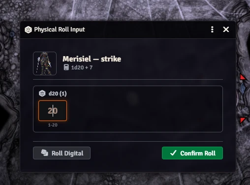

# Physical Play Dice (`pp-dice`) — User Manual & Guide

Welcome to the user manual for **Physical Play Dice (`pp-dice`)**, a module built specifically for **in-person tabletop gaming sessions** with Foundry Virtual Tabletop v14.

---

## 1. Tabletop Concept & Philosophy

When playing tabletop RPGs around a physical table, many groups enjoy:

- The tactile sensation of rolling physical dice.
- Looking at a shared TV, monitor, or projector showing the battlemap without player HUDs or clutter (e.g. using [Monk's Common Display](https://foundryvtt.com/packages/monks-common-display)).
- Letting the GM operate Foundry VTT on a secondary screen to run encounters, measure distances, and track conditions.

Normally, clicking an attack or spell in Foundry triggers its digital random dice roller. Manually modifying numbers or typing raw chat formulas breaks game flow and loses system automation.

**`pp-dice` bridges the table and the virtual tabletop:**
Players roll their physical dice at the table. When the GM triggers an action (attack, save, skill, damage) in Foundry, a lightweight popup asks for the dice results. Foundry and Pathfinder 2e then calculate all modifiers, multiple attack penalties, criticals, and degrees of success automatically.

<p align="center">
  
</p>

---

## 2. Requirements & Installation

### Requirements

- **Foundry VTT**: Version 14 (Build 14.360+).
- **Game System**: System-agnostic (supports core Foundry d20 rolls across any system; primarily tested and deeply optimized for Pathfinder 2e).
- **Required Module**: [`lib-wrapper`](https://foundryvtt.com/packages/lib-wrapper) (Foundry will automatically prompt to install/enable it).

### Installation via Manifest

1. In Foundry VTT, navigate to **Configuration and Setup** $\rightarrow$ **Add-on Modules**.
2. Click **Install Module**.
3. Paste the manifest link into the **Manifest URL** box:
   ```text
   https://github.com/ynsta/pp-dice/releases/latest/download/module.json
   ```
4. Click **Install**.
5. In your game world, enable **Physical Play Dice** in **Manage Modules**.

---

## 3. Recommended In-Person Setup

For the best in-person setup:

| Module                                                                            | Purpose                                                                                             |
| --------------------------------------------------------------------------------- | --------------------------------------------------------------------------------------------------- |
| **[Monk's Common Display](https://foundryvtt.com/packages/monks-common-display)** | Broadcasts a clean player view (no sidebar, no macros, no GM tools) to a shared TV or projector.    |
| **[Dice So Nice!](https://foundryvtt.com/packages/dice-so-nice)**                 | Simulates 3D physics dice on screen that land directly on the numbers rolled at the physical table. |

---

## 4. How It Works

### Player Character Detection

The module automatically identifies who is rolling:

- **Pathfinder 2e**: Any character placed in the active Party sheet or allied with the party is treated as a player.
- **Other systems**: Any actor owned by a player is recognized as a player character.
- **Monsters & NPCs**: Never intercepted. Enemy rolls evaluate digitally without interruption.

### Selective Interception Rules

```
                      ┌────────────────────────┐
                      │   Action / Roll Made   │
                      └───────────┬────────────┘
                                  │
                   Is Player Actor & Enabled?
                                  │
                 ┌────────────────┴────────────────┐
                 │ YES                             │ NO (NPC / Monster)
                 ▼                                 ▼
         Is Secret / Blind?                   Digital Roll
                 │                           (Standard Core RNG)
         ┌───────┴────────┐
         │ NO             │ YES
         ▼                ▼
    GM Input Modal   Digital Roll
   (Physical Dice)  (Keeps Secret)
```

- **Public Player Rolls** (Attacks, Saves, Skills, Perception, Damage) $\rightarrow$ **Intercepted**. The GM dialog pops up immediately to enter physical dice.
- **Secret / Blind Rolls** (Recall Knowledge, Stealth, Secret Perception, Sense Motive) $\rightarrow$ **Digital Roll**. Evaluated with standard digital RNG so neither the GM nor players accidentally reveal secret information.
- **NPC & Monster Rolls** $\rightarrow$ **Digital Roll**. Enemy turns remain instant and automated.

---

## 5. Using the Dice Input Dialog

When a roll is intercepted, the input dialog opens instantly:

1. **Immediate Focus**: The cursor is automatically placed in the primary die box. No mouse click needed.
2. **Keyboard Controls**:
   - **`Enter`**: Submit the entered physical values and complete the roll.
   - **`R`** or **Roll Digital (R)**: Skip manual input and roll digital dice instantly (convenient if a player didn't roll or prefers digital).
   - **`Tab`**: Jump to the next die when multiple dice are rolled (e.g. 2d6 damage).
3. **Multi-Die Rolls**: Spells and damage rolls with multiple dice provide individual input fields for each die.
4. **Safety Validation**: Inputs only accept valid numbers for that die type (e.g. 1–20 for a d20, 1–6 for a d6).

### Fortune & Misfortune (Advantage / Disadvantage)

If a roll has the **Fortune** or **Misfortune** trait (or advantage / disadvantage):

- The dialog displays a badge: `Fortune — Keep Highest` or `Misfortune — Keep Lowest`.
- Two d20 fields are provided for the player's two physical dice.
- The system automatically keeps the appropriate die and calculates the outcome.

### Area of Effect (AoE) Spells & Sequential Rolls

When a fireball hits 4 party members, 4 saving throws trigger in sequence:

- `pp-dice` queues each roll in order.
- As soon as you confirm Player 1's roll, the dialog seamlessly moves to Player 2, then Player 3, etc.
- No overlapping popups or dropped rolls.

### Chat Log Badge

When a roll is completed using physical dice, a discrete **`Physical Roll`** badge appears on the chat card, confirming the roll came from the physical table.

---

## 6. Controls & Hotkeys

- **`Alt+P`**: Default global shortcut to toggle physical interception on or off anytime.
  - **Customizable**: Go to **Game Settings (gear icon)** $\rightarrow$ **Configure Controls** $\rightarrow$ **Package Keybindings** $\rightarrow$ **Physical Play Dice** to bind this toggle to any preferred key combination.
- **Token Controls Toolbar**: A dice tool button in the left controls bar allows one-click toggling with live visual status.

---

## 7. Troubleshooting & FAQ

#### The dialog does not open when a player rolls?

1. Verify that **Physical Play Dice** is enabled in **Manage Modules**.
2. Press `Alt+P` or check the toolbar icon to ensure interception is **Active**.
3. In Pathfinder 2e, make sure the player character is added to the active **Party** sheet.
4. Check if the roll was secret or blind (secret rolls deliberately bypass the dialog to avoid spoiling results).

#### What if a player wants to roll digitally?

Press **`R`** or click **Roll Digital (R)** in the dialog. The module will immediately roll digital dice instead.

#### Does 3D dice animation work?

Yes. If you have **Dice So Nice!** enabled, the 3D dice will roll across the screen and land on the exact physical values you entered.
